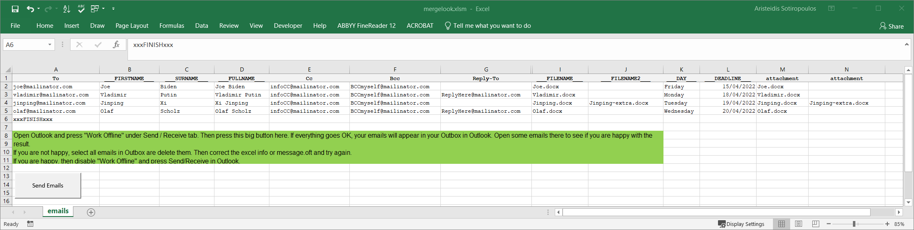

# mergelook

Using **mergelook** you can send multiple emails with attachments, using the same email template. It's like using the mail merge feature of MS Word, but each email can contain one or more attachments. This works only on Microsoft Windows.

## More info

There are times when you want to send a personalized email --based on a common template-- to multiple recipients. MS Word, in combination with Excel and Outlook, offers this functionality which is called Mail Merge. However, the functionality is limited to sending emails without attachments.

With **mergelook** you can send personalized emails with attachments to multiple recipients, using only MS Excel and Outlook. Enjoy!

## Instructions

In order to use **mergelook**, you need to have MS Excel and MS Outlook installed. From this repository, you only need the following files:

+ `mergelook.xlsm`
+ `message.oft`

`message.oft` is the template of the email to be sent to multiple recipients.
Special words in the template will be replaced with information in the `mergelook.xlsm` file. `mergelook.xlsm` is an excel file containing VBA code, which handles the word replacement.

When you open `mergelook.xlsm`, you should press "Enable Content" so that the VBA script can be executed.

### `message.oft`
This is how `message.oft` looks like:

For each email, the ``___NAME___`` will be replaced with corresponding values in `mergelook.xlsm`: ``Donald``, ``Vladimir``, etc. Similarly, the ``___FILENAME___`` will be replaced with corresponding values in `mergelook.xlsm`: ``Donald.docx``, ``Vladimir.docx``, etc.

### `mergelook.xlsm`
This is how `mergelook.xlsm` looks like:

In columns with header ``To``, you should put the recipients' email addresses. Multiple recipients per email (row) are supported. The same goes for the columns with ``Cc`` and ``Bcc`` headers. If for some emails you need to have a different Reply-To address, you can add one email address in the ``Reply-To`` column. The latter **does not** change the **From** email field.

### Sample email
This is how a sample email looks like:

## Attention
**mergelook** should be used as a quick and *dirty* solution to get your job done. This is not meant to be a quality/professional system. I believe that there are such systems available in the market.

## Useful information 

### Use mergelook with Outlook in Offline mode

Before using it, put Outlook in Offline Mode using the following instructions:

1. Open Outook
2. Go to "Send / Receive" tab
3. Press "Work Offline" mode. This button should be pressed

### All files in the same directory
Put all relevant files in the same directory:
- message.oft 
- mergelook.xlsm
- files to attach

### New to VBA?

If you're new to Mergelook or VBA macros, try duplicating the
directory you're using, e.g. mergelook-master and
mergelook-yourname. Make just one or two changes at a time and
generating the outgoing emails again to check if your change came
through as expected. Open up one or two to check them, then keep
selecting them and deleting them, until you're ready to send. If
something goes very awry you can go back to the originals and start
again. Start with the sample files (world leaders.docx), then copy
your attachment files to the directory as well.

### Outbox folder not refreshing

Sometimes Outlook doesn't refresh so you don't see the new emails in
the main pane of Outlook. But you'll see the new number in brackets
after the "Outbox" label in the navigation bar. Click somewhere else
and then back on Outbox to force a refresh, then you can open the
emails and look at them.

### Save as Outlook template when modifying the email template

To modify the email template, open message.oft and make changes. "Save
As Type" Outlook Template, with the same name: message.oft. Make sure
you save and replace the file in the same location, **not in Window's
default template location**.

### Save the excel as .xlsm file

You can of course make changes to the Excel file, but you have to save
it as an xlsm file, so that macros are enabled and the VBA code can
run.

### Leave columns you don't use blank

If there are some parameters in the Mergelook file that you don't
need, just leave those columns blank. Leave the heading in Row 1, but
clear/delete the content from cells in that column. If you do not need
an entire column, you can just delete it.

### Additional parameters

To use additional parameters, carefully change the header to the new
name: from `___DEADLINE___` to `___DEPARTMENT___` for example, or
`___DAY___` to `___STORE___`. Add the new parameter to the message.oft
template and save it as instructed above.

*Advice*: keep the three
underscores so it's clear that this term is a variable.

### To, Cc, Bcc, Reply-To columns

Don't change "To", "Cc", "Bcc" or "Reply-To" column names, because those
four are referenced by name within the macro code. You can delete a
column, if you don't need it.

### Sending the emails

When the Outbox folder is full of emails and you are happy with the
content, press "Work Offline" again in the Send/Receive tab, so that
Outlook is enabled again. In a minute Outlook will start delivering
your emails.

## Common Problems

### Problem: Error when macros stops at "myAttachments.Add Application.ActiveWorkbook.Path & "\" & ActiveSheet.Cells(row, col).Value" ?
Answer: You probably don't have the necessary files in the same
directory; they all need to be together in the same folder.

### Problem: The word `___FILENAME___` shows up in the email, instead of the actual file?
Answer: Check your filename carefully. Have you added the file
extension, exactly? If mergelooks hits an error with a filename the
macro stops attaching files to the rest of the emails.

Another thing that might cause confusion is the following: In the particular example, there is `___FILENAME___ ` and `attachment` columns, both with the value `Donald.docx`. The `___FILENAME___` value will be used so that the string `Donald.docx` is mentioned in the email, while the `attachment` value will be used to attach the actual `Donald.docx` file in the corresponding email.
